可以通过官网注册 Key 后使用：

- 官网注册入口：[http://47.97.59.120](http://47.97.59.120)
- Agent 独立仓库：[https://github.com/qiwentaidi/Hephaestus-Agent](https://github.com/qiwentaidi/Hephaestus-Agent)

## 运行截图

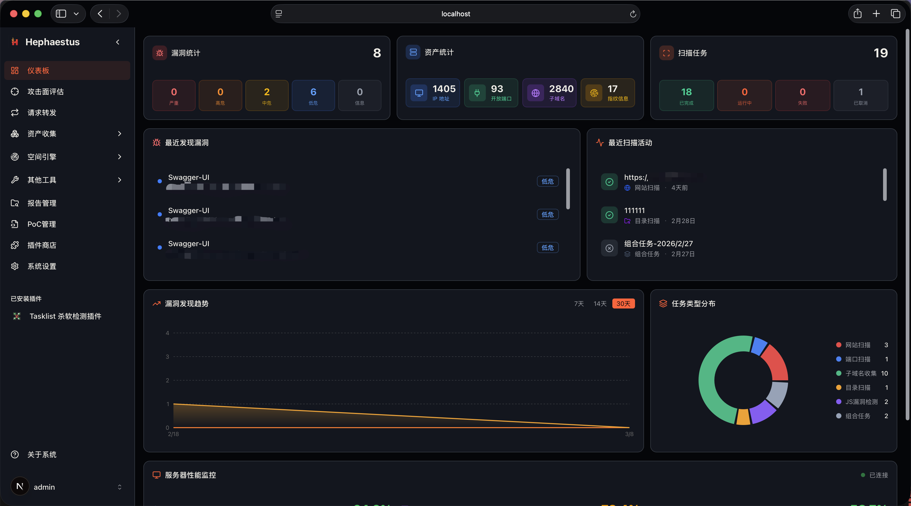

### 攻击面评估

支持常见的网站扫描、端口扫描、JS漏洞检测等多种任务，每个界面等参数都可以在设置处存储为你的专属扫描模板（使用时导入即可），以及特色的任务流模式，你可以自定义需要扫描的步骤和流程，任务流中也支持每个单独模块的配置

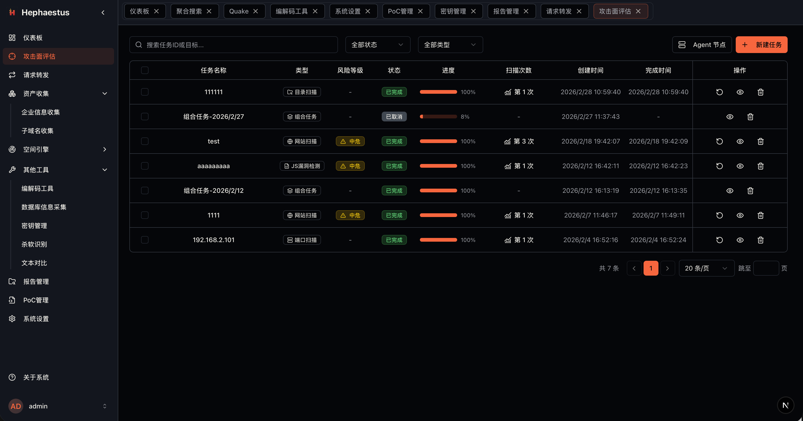

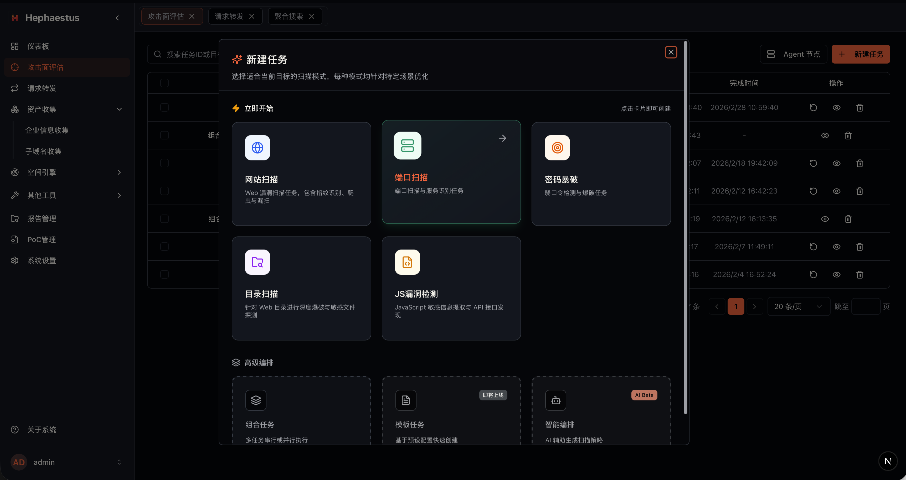

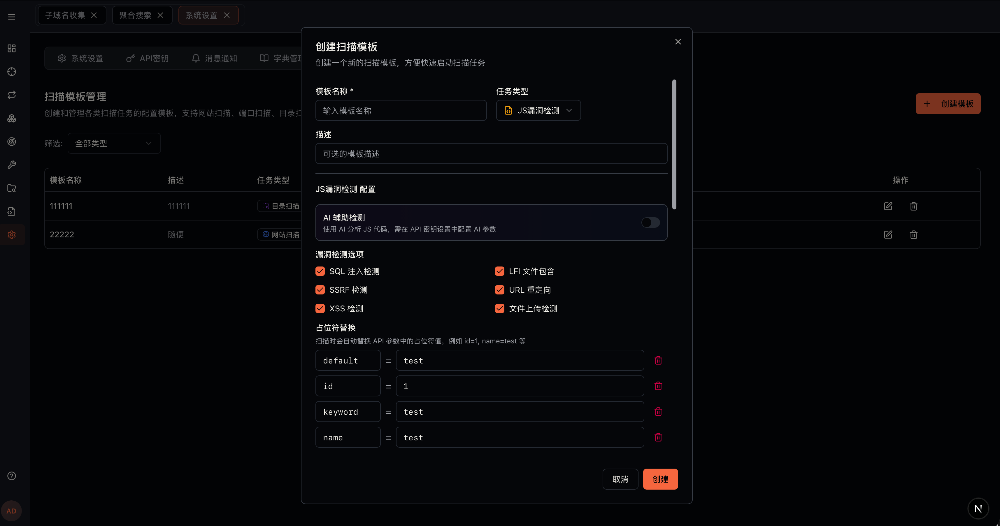

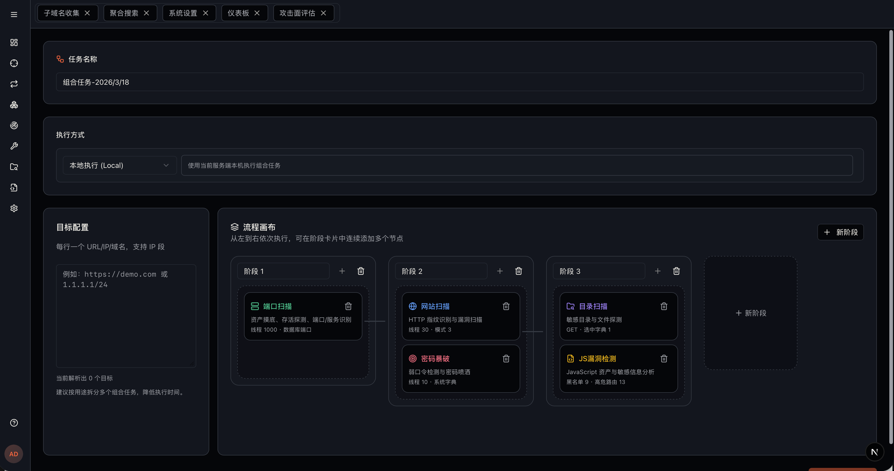

### 请求转发

覆盖BurpSuite Repeater的常见请求发送功能

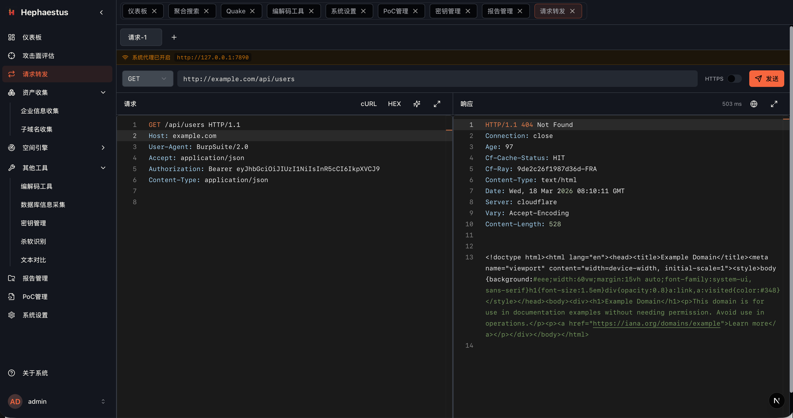

### 企业信息收集

支持0zone、icp_query、riskbird接口进行数据查询

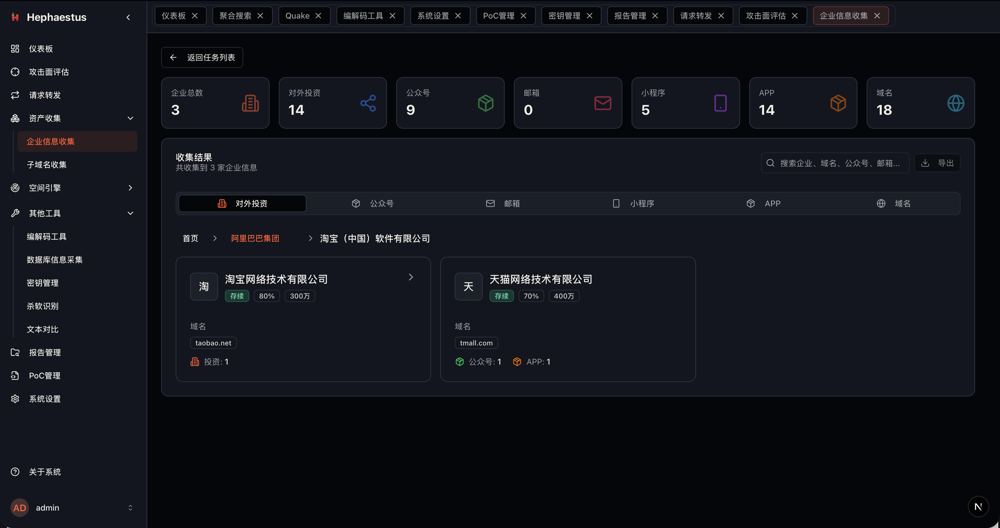

### 聚合搜索

底层适配转换所有接口的查询语句，你在界面上只需要通过一个语法就可以做出查询，按需加载更多数据

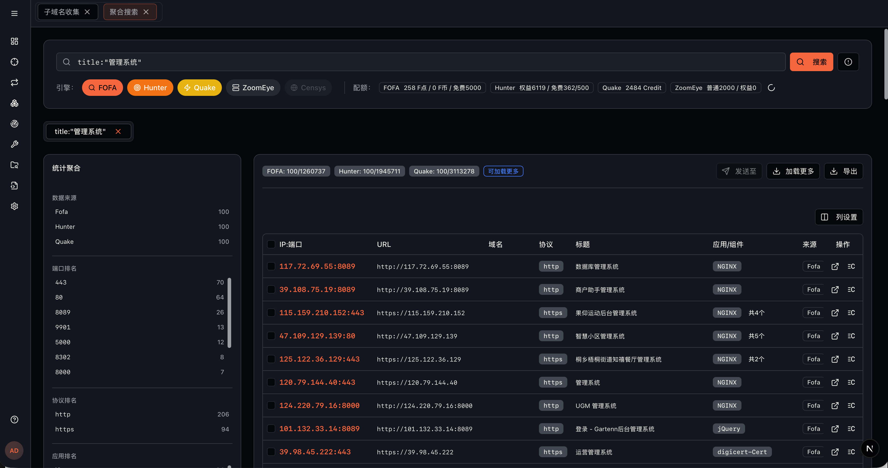

### 报告管理

支持所有类型的任务导出，以及常见的Word、Excel等形式

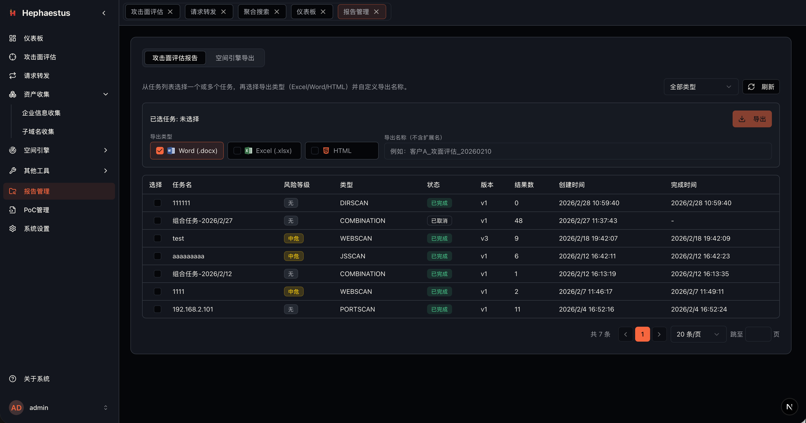

### 编解码功能

覆盖常见的CyberChef使用情况，以及一些密码解密功能

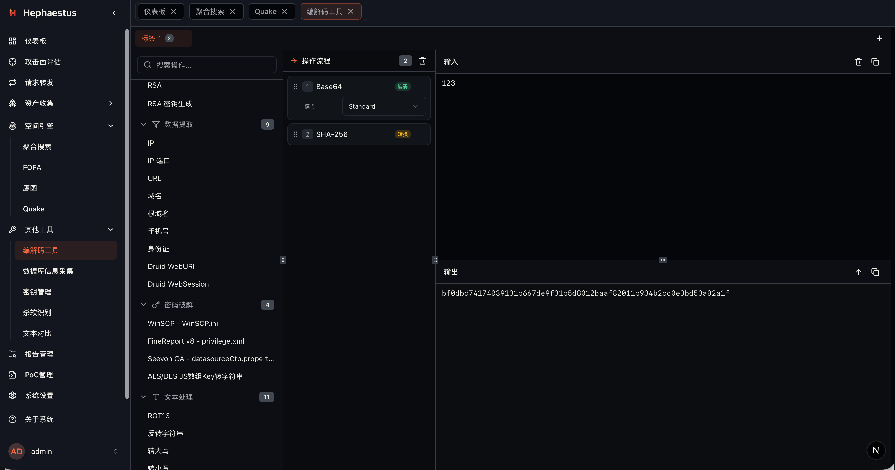

### PoC管理

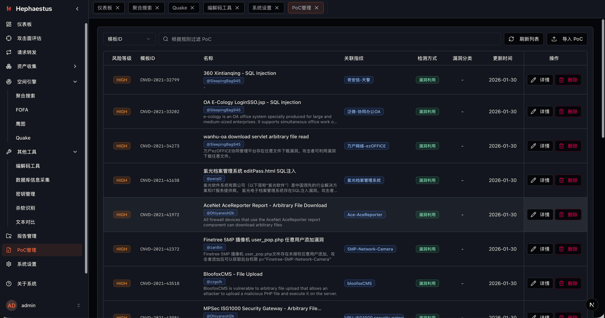

## 快速开始

在需要单独部署扫描节点时，可参考 Agent 仓库：

- [https://github.com/qiwentaidi/Hephaestus-Agent](https://github.com/qiwentaidi/Hephaestus-Agent)

### 1️⃣ 使用 Docker 部署 PostgreSQL

系统依赖 PostgreSQL，如果没有请先通过 Docker 启动数据库服务：

```
docker run -d \
  --name my-postgres \
  -e POSTGRES_USER=postgres \
  -e POSTGRES_PASSWORD=Hephaestus@123. \
  -e POSTGRES_DB=hephaestus \
  -p 5432:5432 \
  -v pgdata:/var/lib/postgresql/data \
  postgres:15
```

说明：

- 数据库名称：`hephaestus`
- 用户名：`postgres`
- 密码：`Hephaestus@123.`
- 默认端口：`5432`
- 数据会持久化到 Docker volume：`pgdata`

> ⚠️ 请确保本地 5432 端口未被占用，或自行修改映射端口。

------

### 2️⃣ 启动程序

根据你的操作系统与 CPU 架构，运行对应的可执行文件即可：

```
./hephaestus-xx-xx
```

程序启动后：

- 会在**命令行输出当前运行状态**
- 首次启动或配置变更时，相关配置项也会在终端中提示

------

### 3️⃣ 修改服务端口（可选）

程序默认监听端口为 **18181**。
 如需修改端口，请编辑用户家目录下的配置文件：

```
~/.config/hephaestus/config.yaml
```

示例：

```
server:
  port: 18181
```

⚠️ 注意事项：

- **配置文件与可执行程序需位于同一用户环境**
- 修改端口后需重启程序生效
- 请确保端口未被占用

------

### 4️⃣ Linux 截图功能说明

在 Linux 环境下，如发现**截图功能不可用**，请自行确认系统是否已安装 Chromium 相关依赖。

常见原因包括：

- 未安装 `chromium` / `chromium-browser`
- 缺少必要的字体或图形依赖
- 运行环境为精简版 Server / 容器环境

> 建议优先在具备完整桌面依赖的 Linux 环境中使用截图功能。
